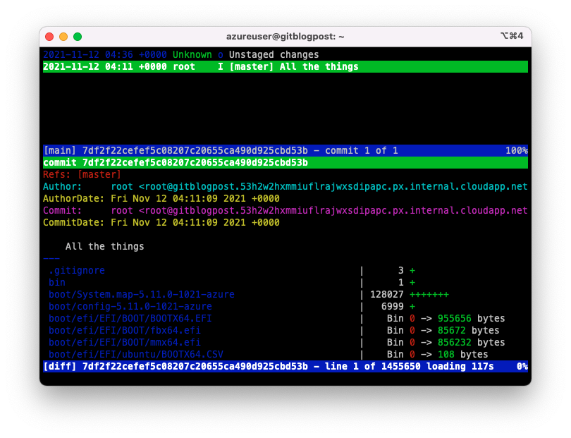

I'm a huge fan of [Git](https://git-scm.com/) and it's capabilities not only for source code, but a variety of other use cases.  At `$previousjob`, I spearheaded a project to migrate an extensive amount of infrastructure and OS level customisations from Puppet to Ansible and subsequently relied on git to keep me honest about what i'd missed or misconfigured.  Because [everything is a file](https://en.wikipedia.org/wiki/Everything_is_a_file), you can `git init` an entire vanilla Ubuntu OS with three simple commands:


Not for the faint hearted, and certainly not for production!



# 1. Initialise git at the root filesystem
azureuser@devbox:~$ sudo git init /
Initialized empty Git repository in /.git/

# 2. Ignore pesky erroneous paths
azureuser@devbox:~$ echo /proc /dev /sys | xargs -n1 | sudo tee /.gitignore &> /dev/null

# 3. Index the entire filesystem
azureuser@devbox:~$ sudo git add -A && sudo git commit -a -m 'All the things' &> /dev/null


Now that you're armed with a usable git repository, let's see what's changed:


azureuser@devbox:~$ sudo git status
On branch master
Changes not staged for commit:
  (use "git add <file>..." to update what will be committed)
  (use "git restore <file>..." to discard changes in working directory)
	modified:   ../../var/lib/waagent/waagent_status.1.json
	modified:   ../../var/log/auth.log
	modified:   ../../var/log/journal/190db6655a8548a381903cb7b84c2323/system.journal
	modified:   ../../var/log/kern.log
	modified:   ../../var/log/syslog


Or more easily
Or explore the changes with the fantastic [tig](https://jonas.github.io/tig/) tool:

I've used this technique on a number of occassions as a quick and simple method to learn more about Linux, understand and visualise what's happening on a host or to audit changes made by a particular process (such as better understanding Terraform to build an upgrader tool to facilitate code and state upgrades from 0.11 to 1.0 [more about this in a later blog post]).  I utilise `.gitignore` or stage/commit changes to narrow down the files i'm investigating depending on the experiment/situation.

To clean up when you're done:


azureuser@devbox:~$ sudo rm -rf /.git /.gitignore


How do you misuse Git for personal gain? Let me know in the comments.
